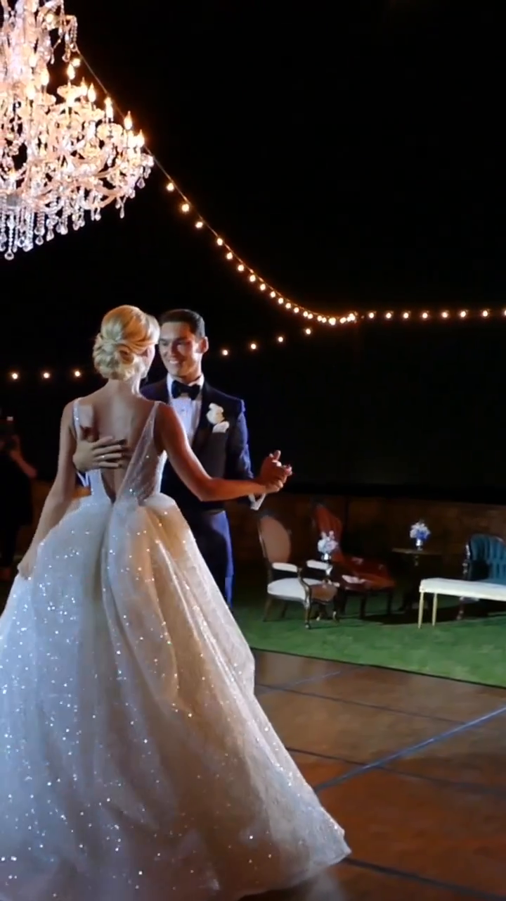
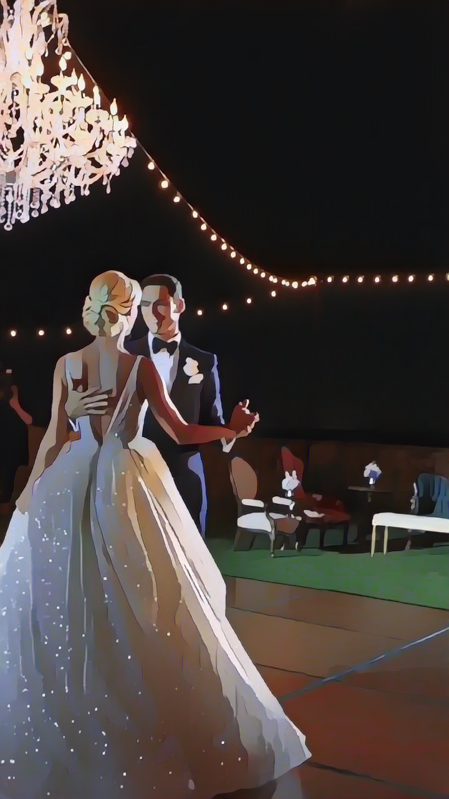

# Cartoonization image and Video

This code is based on following paper and project:

### [CVPR2020]Learning to Cartoonize Using White-box Cartoon Representations
[project page](https://systemerrorwang.github.io/White-box-Cartoonization/) |   [paper](https://github.com/SystemErrorWang/White-box-Cartoonization/blob/master/paper/06791.pdf)
 
***

## Install

create conda env with **python 3.7**
````
conda create -n cartoon python=3.7
````
install tensorflow 1.15 
```
conda install -c anaconda cudatoolkit=10.0
conda install -c anaconda cudnn=7.6.5
pip install tensorflow-gpu==1.15
```

install requirements
````
conda env update --file cartoon_env.yml --prune
````
***
## Inference

### for video
1. extract frames into images:
````
python step_1_extract_frames.py
````
2. run cartoonize:
````
python cartoonize.py
````
3. create cartoonized video
````
python step_3_create_video.py
````

* Set custom frame rate in step 1 and step 3 

### for image

* images ==> ./test_images
* run cartoonize:
````
python cartoonize.py
````

***

## example

| Real Image                           | Cartoonized Image                                |
|--------------------------------------|--------------------------------------------------|
|    |  |
